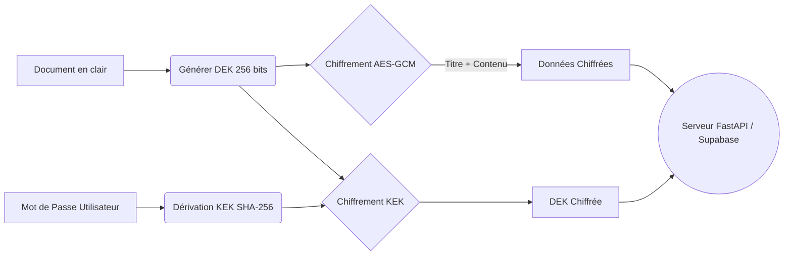
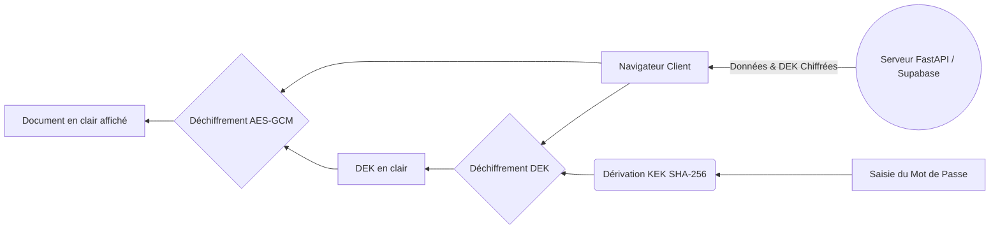

<div align="center">
  
  <h1 align="center">MedVault</h1>

  <p align="center">
    <strong>Plateforme de Stockage Médical Sécurisée (Zero-Knowledge)</strong>
    <br />
    <br />
    <a href="#caractéristiques">Caractéristiques</a>
    ·
    <a href="#installation">Installation</a>
    ·
    <a href="#architecture">Architecture</a>
    ·
    <a href="#sécurité">Sécurité</a>
  </p>

  <p align="center">
    
    
    
    
    
  </p>
</div>

<hr />

## 🛡️ À propos de MedVault

**MedVault** est une application web de stockage de documents médicaux axée sur la confidentialité absolue. Grâce à un **chiffrement de bout en bout (Zero-Knowledge)**, tous les documents sont chiffrés directement dans votre navigateur. Le serveur ne reçoit, ne stocke, et ne distribue que des données incompréhensibles.

**Votre vie privée n'est pas une option, c'est la fondation de cette architecture.**

---

## ✨ Caractéristiques Principales

*   🔒 **Zero-Knowledge Architecture** : Le serveur n'a jamais accès à vos données en clair, ni à vos mots de passe.
*   🚀 **Performance & API REST** : Propulsé par **FastAPI**, offrant des endpoints JSON rapides et modernes.
*   🛡️ **Cryptographie Avancée** : Intègre des standards industriels tels que **AES-256-GCM**, **SHA-256**, **BLAKE2b**, et **RSA-2048/4096**.
*   💾 **Stockage Résilient** : Base de données gérée via **Supabase** (PostgreSQL).
*   🌐 **Interface Intuitive** : Une application web sans friction pour chiffrer et déchiffrer à la volée.

---

## 🚀 Démarrage Rapide

### 1. Prérequis

*   Python 3.10 ou supérieur
*   Un projet [Supabase](https://supabase.com/) actif

### 2. Installation

```bash
# Cloner le dépôt
git clone https://github.com/VOTRE_NOM_UTILISATEUR/chiffrement.git
cd chiffrement

# Installer les dépendances
pip install -r requirements.txt
```

### 3. Configuration de l'environnement

Créez un fichier `.env` à la racine du projet et ajoutez vos identifiants Supabase :

```env
SUPABASE_URL=https://votre-projet.supabase.co
SUPABASE_SERVICE_ROLE_KEY=votre-cle-secrete
```

### 4. Initialisation de la Base de Données

1. Rendez-vous sur votre console **Supabase**.
2. Ouvrez le **SQL Editor**.
3. Copiez, collez et exécutez le contenu du fichier `migration.sql`.

### 5. Lancement de l'Application

```bash
# Démarrer le serveur API
python main.py
```
*Le serveur sera accessible sur `http://127.0.0.1:8000`.*

Pour utiliser l'interface client, ouvrez simplement le fichier `index.html` dans votre navigateur préféré.

---

## 🏗️ Architecture & Flux de Chiffrement

L'application repose sur un mécanisme cryptographique asymétrique/symétrique hybride pour garantir une sécurité maximale tout en conservant d'excellentes performances.

### Transmission Sécurisée (Chiffrement)



### Consultation (Déchiffrement)



---

## 🔒 Focus sur la Sécurité

| Algorithme | Usage | Niveau de Sécurité |
| :--- | :--- | :--- |
| **AES-256-GCM** | Chiffrement symétrique des documents | ⭐⭐⭐⭐⭐ (Norme militaire) |
| **SHA-256 / BLAKE2b** | Dérivation de clés et intégrité | ⭐⭐⭐⭐⭐ (Standard NIST) |
| **RSA-2048/4096** | Chiffrement asymétrique (disponible) | ⭐⭐⭐⭐⭐ (Très haute sécurité) |

*Notes:* 
- *Le mode GCM assure non seulement la confidentialité mais aussi l'**authenticité** des données (protection contre les altérations).*
- *Aucune clé n'est transmise au réseau (Zero-Knowledge). Si vous perdez votre mot de passe, vos documents sont définitivement illisibles.*

---

## 📚 Documentation Détaillée

Pour aller plus loin, veuillez consulter le [Manuel Utilisateur (user_manual.md)](user_manual.md) qui contient :
- Les spécifications techniques détaillées.
- Des exemples d'appels API (cURL).
- Le guide complet d'utilisation.

---

## 🤝 Contribution

Les contributions sont les bienvenues ! 
1. Forkez le projet
2. Créez votre branche (`git checkout -b feature/IncroyableFonctionnalite`)
3. Commitez vos changements (`git commit -m 'Ajout d'une fonctionnalité incroyable'`)
4. Pushez vers la branche (`git push origin feature/IncroyableFonctionnalite`)
5. Ouvrez une Pull Request

---

## 📄 Licence

Ce projet est distribué sous la licence MIT. Voir le fichier `LICENSE` pour plus d'informations.

<p align="center">
  <i>Développé pour garantir le secret médical et la souveraineté numérique.</i>
</p>
